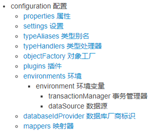

## MyBatis-config.xml配置

> MyBatis 的配置文件包含了会深深影响 MyBatis 行为的设置（settings）和属性（properties）信息。文档的顶层结构如下：



## properties属性

此配置可以把数据库连接信息配置到另外一个配置文件中，实际工作中数据库连接一般交给Spring管理，此配置一般不用

## setting设置 

```xml
<settings>
  <setting name="mapUnderscoreToCamelCase" value="true"/>
</settings>
```

先只看一个，此配置默认是false，此配置可以把数据库字段中的下划线替换成java实体类中的驼峰式变量

例如：
`数据库中 user_name 可以自动映射为java实体类中的 userName`

## typeAliases 类型别名

映射文件中,默认只能写全类名：
配置此项后，可以给全类名起别名，在映射文件中方便书写：

```xml
<typeAliases>
  <typeAlias alias="User" type="com.weixin.User"/>
</typeAliases>
```

或者

```xml
<typeAliases>
  <typeAlias type="com.weixin.User"/>
</typeAliases>
```

!> 上面配置会有默认别名 user ,别名是不区分大小写的，我们在映射文件中还是建议使用User

?> 最优方案👉 一个一个写别名又很麻烦，所以直接指定实体类所在的包，包下所有实体类都会设置别名

```xml
<typeAliases>
    <package name="com.weixin.bean"/>
</typeAliases>
```

## typeHandlers 类型处理器

数据库中的类型和java类型的映射都是依靠此类型处理器，比如数据库的char,varchar将会映射为java的String类型，一般不需要再单独设配置

## environments 环境

```xml
<environments default="development">
  <environment id="development">
    <transactionManager type="JDBC">
      <property name="..." value="..."/>
    </transactionManager>
    <dataSource type="POOLED">
      <property name="driver" value="${driver}"/>
      <property name="url" value="${url}"/>
      <property name="username" value="${username}"/>
      <property name="password" value="${password}"/>
    </dataSource>
  </environment>

  <environment id="test">
    <transactionManager type="JDBC">
      <property name="..." value="..."/>
    </transactionManager>
    <dataSource type="POOLED">
      <property name="driver" value="${driver}"/>
      <property name="url" value="${url}"/>
      <property name="username" value="${username}"/>
      <property name="password" value="${password}"/>
    </dataSource>
  </environment>
</environments>
```

我们可以配置多个数据库连接信息，比如开发阶段连接一个，测试阶段连接另一个，只需要修改default的值即可

